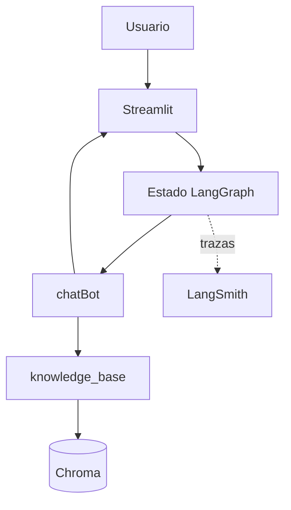

# chatBot

Proyecto genérico de chatbot con un único agente. Responde consultas sobre un
negocio o empresa, sus servicios, valores y contacto, además de guiar procesos
como registro, login y recuperación de acceso.

El proyecto integra Streamlit, LangChain, LangGraph, Chroma, LangSmith, Docker
y Kubernetes.

## Arquitectura



La descripción completa está en
[docs/architecture.md](docs/architecture.md).

## Fuentes de conocimiento

| Fuente | Uso |
|---|---|
| `knowledge_base/` | Toda la información, servicios, contacto, guías, políticas y procedimientos |

`knowledge_base` es la única fuente local y no parametrizada. El orquestador
decide qué documentos incorporar a ella.

## Requisitos

- Python 3.12;
- Docker Desktop para contenedores;
- `kubectl` y `kind` para Kubernetes local;
- una API compatible con OpenAI o una cuenta de Hugging Face;
- LangSmith opcional para trazas y evaluaciones.

## Instalación local

```powershell
python -m venv .venv
.\.venv\Scripts\Activate.ps1
python -m pip install --upgrade pip
python -m pip install -r requirements.txt
Copy-Item .env.example .env
```

Completá en `.env` al menos un proveedor de modelo:

```env
OPENAI_API_BASE=https://endpoint-compatible/v1
OPENAI_API_KEY=...
OPENAI_MODEL=...
```

También puede utilizarse `HUGGINGFACEHUB_API_TOKEN` y `HF_MODEL_ID`. El `.env`
real está excluido de Git y no debe contenerse en la imagen.

La búsqueda web externa está desactivada por defecto, por lo que la recuperación
usa exclusivamente `knowledge_base`:

```env
WEB_SEARCH_ENABLED=false
WEB_SEARCH_PROVIDER=tavily
WEB_SEARCH_API_KEY=
WEB_SEARCH_ALLOWED_DOMAINS=argentina.gob.ar
WEB_SYNC_LOCAL_ON_DIFFERENCE=true
```

Al cambiar `WEB_SEARCH_ENABLED=true`, `primary_retrieve_context` consulta Tavily
como fuente principal. Si Tavily no está disponible, falla la conexión o no hay
resultados autorizados, la herramienta usa automáticamente RAG local. El contenido
web nuevo o modificado se sincroniza con URL y fecha en
`knowledge_base/actualizaciones_web.md`, sin sobrescribir los manuales canónicos.
Para activarlo, configurá la clave del proveedor, uno o más dominios separados por
comas y reiniciá la aplicación. Las herramientas web solo pueden consultar
`WEB_SEARCH_ALLOWED_DOMAINS`.

## Ejecución rápida

Aplicación local:

```powershell
streamlit run app.py
```

Abrí `http://localhost:8501`.

API para un frontend C#/JavaScript:

```powershell
uvicorn api:app --reload --port 8000
```

La API queda disponible en `http://localhost:8000` y su contrato interactivo
en `http://localhost:8000/docs`. `POST /api/chat` recibe `message` y,
opcionalmente, `conversation_history`; `GET /api/history` recupera el historial
persistido. `sources` informa `knowledge_base` o `web` según la fuente usada.
Los errores de validación (por ejemplo, mensajes vacíos o un `limit` fuera de
1–500) responden con HTTP 422. Para un
frontend remoto, configurá
`API_CORS_ORIGINS` separado por `;` en `.env` (por ejemplo,
`https://mi-frontend.example.com`).

Con Docker Compose:

```powershell
docker compose up --build
```

Compose publica Streamlit en `http://localhost:8501` y la API en
`http://localhost:8000`.

## Ejemplos de uso

### Consultas generales

- “¿Qué servicios ofrece la empresa?”
- “¿Cuáles son sus valores y horarios?”
- “¿Cómo contacto a soporte?”
- “¿Cómo me registro o recupero mi contraseña?”

### Procedimientos

- “¿Qué política se aplica a esta gestión?”
- “Resumí el procedimiento documentado para este trámite.”
- “¿Qué requisitos indica el manual técnico?”

## Inicialización e inspección de datos

```powershell
python scripts/data/initialize_knowledge_vector_store.py
python scripts/data/rebuild_knowledge_vector_store.py
python scripts/data/inspect_sqlite_database.py
```

Las utilidades restantes están documentadas por su nombre en `scripts/data/`.

## Pruebas

La suite es local y no requiere credenciales de proveedores. La guía de alcance
y resolución de problemas está en [docs/testing.md](docs/testing.md).

```powershell
python -m compileall -q .
python tests/test_persistence.py
python tests/test_retrieval_policy.py
python tests/test_rag_retrieval.py
python tests/test_api.py
.\scripts\validate-k8s.ps1
```

## Kubernetes local

```powershell
docker build -t chatbot:local .
kind create cluster --config k8s/local/kind-config.yaml
kind load docker-image chatbot:local `
  --name chatbot
Copy-Item k8s/secrets.env.example k8s/secrets.env
```

Después de completar `k8s/secrets.env`:

```powershell
kubectl apply -f k8s/base/namespace.yaml
kubectl -n chatbot create secret generic `
  chatbot-secrets `
  --from-env-file=k8s/secrets.env `
  --dry-run=client -o yaml |
  kubectl apply -f -
kubectl apply -k k8s/overlays/local
kubectl rollout status deployment/chatbot `
  -n chatbot --timeout=10m
kubectl port-forward service/chatbot 8501:80 `
  -n chatbot
```

La guía completa y la evidencia de ejecución están en
[docs/kubernetes.md](docs/kubernetes.md) y
[docs/evidence/README.md](docs/evidence/README.md).

## Evaluación con LangSmith

Configurá `LANGSMITH_API_KEY`, `LANGSMITH_PROJECT` y un dataset con entradas
`question`. Luego ejecutá:

```powershell
python -m trajectory_evaluation.create_dataset
python -m trajectory_evaluation.trajectory_accuracy `
  --dataset chatBot-trajectory
```

Los resultados y su procedimiento reproducible se encuentran en
[docs/evaluation-results.md](docs/evaluation-results.md).

## Documentación

El índice completo está en [docs/README.md](docs/README.md).

## Estado del proyecto

La arquitectura es desplegable. Para producción se deben gestionar secretos
externamente, evaluar PostgreSQL para el historial, utilizar almacenamiento
vectorial compartido e instalar monitoreo y backups.
