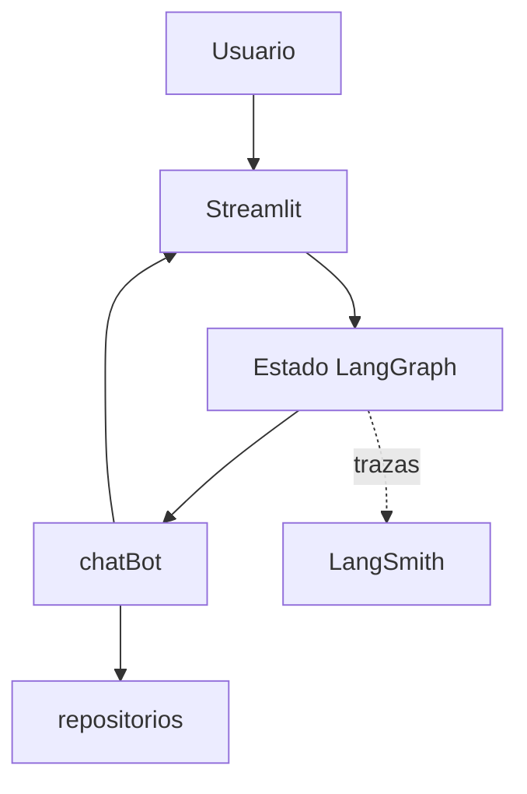

# chatBot

Proyecto genérico de chatbot con un único agente. Responde consultas sobre un
negocio o empresa, sus servicios, valores y contacto, además de guiar procesos
como registro, login y recuperación de acceso.

El proyecto integra Streamlit, LangChain, LangGraph, LangSmith, Docker
y Kubernetes.

## Arquitectura



La descripción completa está en
[docs/architecture.md](docs/architecture.md).

## Fuentes de conocimiento

| Fuente | Uso |
|---|---|
| `repositorios/` | Código fuente real consultado y modificado por el agente |

El proyecto dentro de `repositorios` es la única fuente técnica autorizada.

## Requisitos

- Python 3.12;
- Docker Desktop para contenedores;
- `kubectl` y `kind` para Kubernetes local;
- una API compatible con OpenAI o una cuenta de Hugging Face;
- LangSmith opcional para trazas y evaluaciones.

## Instalación local

```powershell
python -m venv .venv
.\.venv\Scripts\Activate.ps1
python -m pip install --upgrade pip
python -m pip install -r requirements.txt
Copy-Item .env.example .env
```

Completá en `.env` al menos un proveedor de modelo:

```env
OPENAI_API_BASE=https://endpoint-compatible/v1
OPENAI_API_KEY=...
OPENAI_MODEL=...
```

También puede utilizarse `HUGGINGFACEHUB_API_TOKEN` y `HF_MODEL_ID`. El `.env`
real está excluido de Git y no debe contenerse en la imagen.

La recuperación consulta exclusivamente el código dentro de `repositorios`; no
utiliza búsqueda web, manuales parametrizados ni bases vectoriales.

## Ejecución rápida

Aplicación local:

```powershell
streamlit run app.py
```

Abrí `http://localhost:8501`.

API para un frontend C#/JavaScript:

```powershell
uvicorn api:app --reload --port 8000
```

La API queda disponible en `http://localhost:8000` y su contrato interactivo
en `http://localhost:8000/docs`. `POST /api/chat` recibe `message` y,
opcionalmente, `conversation_history`; `GET /api/history` recupera el historial
persistido; `DELETE /api/history` lo elimina explícitamente. `sources` informa
los archivos del repositorio usados por la respuesta.
Los errores de validación (por ejemplo, mensajes vacíos o un `limit` fuera de
1–500) responden con HTTP 422. Para un
frontend remoto, configurá
`API_CORS_ORIGINS` separado por `;` en `.env` (por ejemplo,
`https://mi-frontend.example.com`).

El contrato completo está en [docs/api.md](docs/api.md).

Con Docker Compose:

```powershell
docker compose up --build
```

Compose publica Streamlit en `http://localhost:8501` y la API en
`http://localhost:8000`.

## Ejemplos de uso

### Consultas generales

- “¿Qué servicios ofrece la empresa?”
- “¿Cuáles son sus valores y horarios?”
- “¿Cómo contacto a soporte?”
- “¿Cómo me registro o recupero mi contraseña?”

### Procedimientos

- “¿Qué política se aplica a esta gestión?”
- “Resumí el procedimiento documentado para este trámite.”
- “¿Qué requisitos indica el manual técnico?”

## Configuración del repositorio

La búsqueda se realiza directamente sobre el código, sin base vectorial ni
índices persistidos:

```env
AGENT_PROJECT_ROOT=./repositorios/rrhh
PROJECT_INDEX_CHUNK_SIZE=2400
PROJECT_INDEX_CHUNK_OVERLAP=400
PROJECT_INDEX_TOP_K=10
```

## Consultar y modificar el proyecto web

El agente usa `AGENT_PROJECT_ROOT` como límite de lectura y escritura. Las
preguntas de arquitectura, procesos o archivos se responden con fragmentos del
repositorio y rutas de origen. Los pedidos explícitos de creación o modificación
se convierten en cambios puntuales y se validan antes de escribir.

Ejemplos:

- `Explicá el proceso de aprobación de licencias de punta a punta.`
- `¿Qué pantalla invoca GetAreasParaDDJJ104 y qué servicio la resuelve?`
- `Modificá WebAsistencia/WebRH/... para validar el campo antes de guardar.`
- `Creá una clase de pruebas para este servicio siguiendo el patrón existente.`

Las rutas absolutas, los escapes con `..`, los tipos binarios y las ediciones
ambiguas se rechazan sin escribir archivos.

## Pruebas

La suite es local y no requiere credenciales de proveedores. La guía de alcance
y resolución de problemas está en [docs/testing.md](docs/testing.md).

```powershell
python -m compileall -q .
python tests/test_persistence.py
python tests/test_api.py
python tests/test_project_agents.py
.\scripts\validate-k8s.ps1
```

## Kubernetes local

```powershell
docker build -t chatbot:local .
kind create cluster --config k8s/local/kind-config.yaml
kind load docker-image chatbot:local `
  --name chatbot
Copy-Item k8s/secrets.env.example k8s/secrets.env
```

Después de completar `k8s/secrets.env`:

```powershell
kubectl apply -f k8s/base/namespace.yaml
kubectl -n chatbot create secret generic `
  chatbot-secrets `
  --from-env-file=k8s/secrets.env `
  --dry-run=client -o yaml |
  kubectl apply -f -
kubectl apply -k k8s/overlays/local
kubectl rollout status deployment/chatbot `
  -n chatbot --timeout=10m
kubectl port-forward service/chatbot 8501:80 `
  -n chatbot
kubectl port-forward service/chatbot 8000:8000 `
  -n chatbot
```

La guía completa y la evidencia de ejecución están en
[docs/kubernetes.md](docs/kubernetes.md) y
[docs/evidence/README.md](docs/evidence/README.md).

## Evaluación con LangSmith

Configurá `LANGSMITH_API_KEY`, `LANGSMITH_PROJECT` y un dataset con entradas
`question`. Luego ejecutá:

```powershell
python -m trajectory_evaluation.create_dataset
python -m trajectory_evaluation.trajectory_accuracy `
  --dataset chatBot-trajectory
```

Los resultados y su procedimiento reproducible se encuentran en
[docs/evaluation-results.md](docs/evaluation-results.md).

## Documentación

El índice completo está en [docs/README.md](docs/README.md).

## Estado del proyecto

La arquitectura es desplegable. Para producción se deben gestionar secretos
externamente, evaluar PostgreSQL para el historial e instalar monitoreo y backups.
